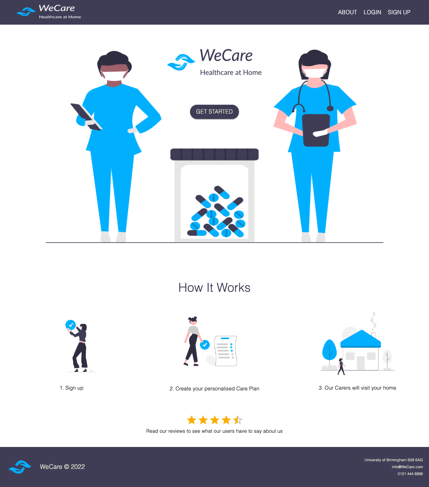
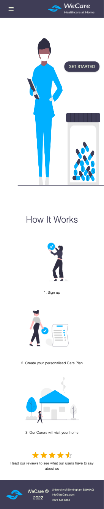
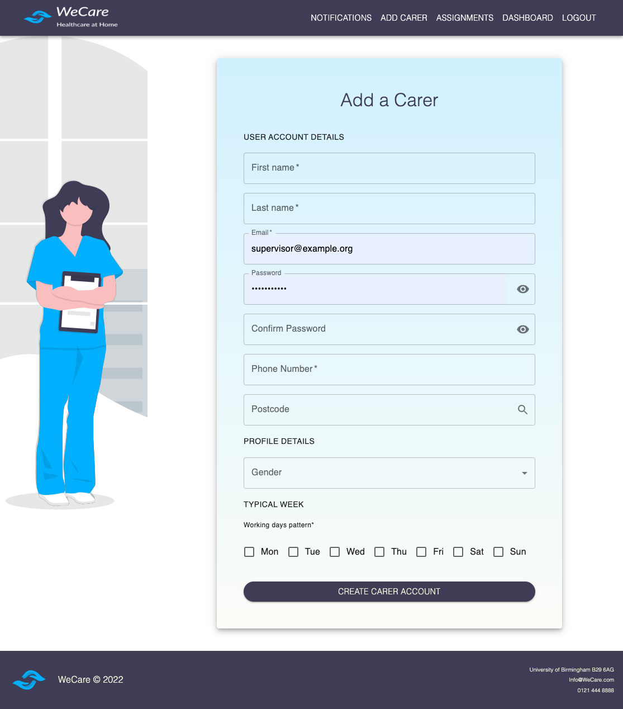

# WeCare 


React-powered front-end for app allowing efficient collaboration between carers and care users.

[Deployed URL](https://floating-river-62141.herokuapp.com/)

## Technologies

- React
- MongoDB
- Mongoose ODM
- GraphQL
- Node

## Screenshots

<details>
<summary>Landing Page: Desktop</summary>



</details>

<details>
<summary>Landing Page: Mobile</summary>



</details>

<details>
<summary>Sample Page: Desktop</summary>



</details>

</br>

## User Story

```md
AS A Care App user who is involved with care provision
I WANT to access my all the information about care in one place and make live changes
SO THAT the quality of care provision is optimised
```
